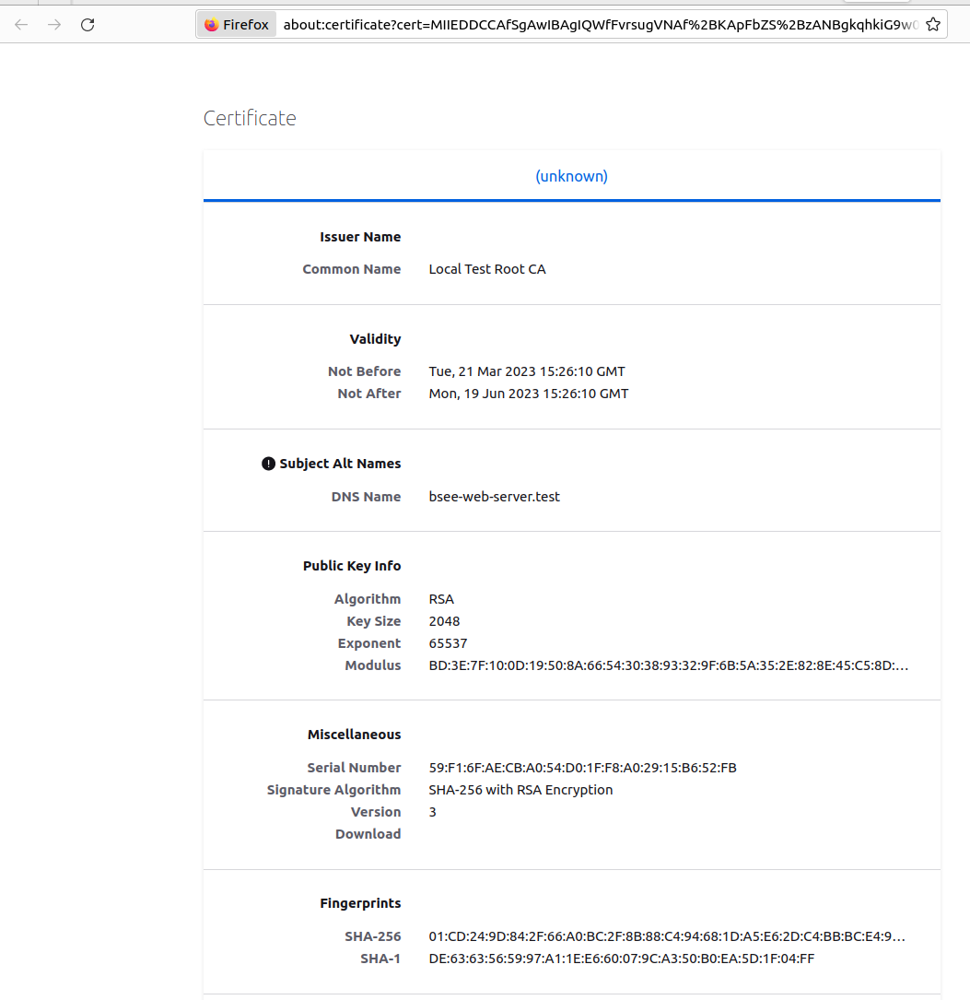
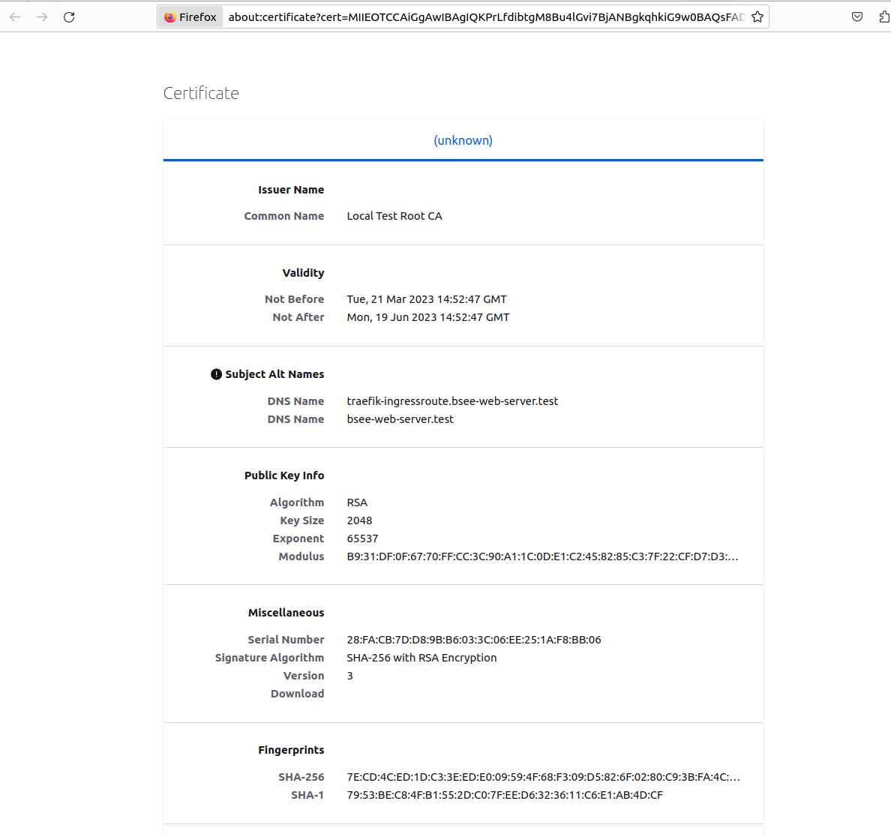

- [Local Microk8s Burp Enterprise Kubernetes PoC](#local-microk8s-burp-enterprise-kubernetes-poc)
  - [Install](#install)
    - [Cluster Setup](#cluster-setup)
      - [Install Microk8s](#install-microk8s)
      - [Setup NFS](#setup-nfs)
      - [Create the Kubernetes Namespace](#create-the-kubernetes-namespace)
      - [Setup the Database](#setup-the-database)
      - [Setup Burp Enterprise](#setup-burp-enterprise)
    - [Use Traefik For Ingress](#use-traefik-for-ingress)
    - [Enable Certificate Manager](#enable-certificate-manager)
  - [CI/CD](#cicd)
    - [GitLab](#gitlab)
      - [Install](#install-1)
      - [Create a Test Pipeline to Confirm Connectivity/Certificates/Trust](#create-a-test-pipeline-to-confirm-connectivitycertificatestrust)


# Local Microk8s Burp Enterprise Kubernetes PoC 

## Install

### Cluster Setup

#### Install Microk8s

```bash
$ sudo apt update && sudo apt upgrade -y && sudo apt install docker
$ sudo snap install microk8s --classic
$ sudo usermod -a -G microk8s $USER
$ sudo chown -f -R $USER ~/.kube
$ newgrp microk8s
$ microk8s status --wait-ready
$ microk8s kubectl get nodes
$ microk8s enable dns helm ingress
```

#### Setup NFS

```bash
$ sudo apt-get install nfs-kernel-server
$ sudo mkdir -p /srv/nfs
$ sudo chown nobody:nogroup /srv/nfs
$ sudo chmod 0777 /srv/nfs
$ #echo '/srv/nfs 10.0.0.0/24(rw,sync,no_subtree_check)' | sudo tee /etc/exports
$ #echo '/srv/nfs 10.0.0.0/24(rw,sync,no_subtree_check,root_squash)' | sudo tee /etc/exports
$ echo '/srv/nfs 10.0.0.0/24(rw,sync,no_subtree_check,no_root_squash)' | sudo tee /etc/exports
$ sudo systemctl restart nfs-kernel-server
$ #had to change permissions to 777 for /srv/nfs in order for pvc in the cluster to have write permissions - not ideal. I'm not sure what I'm doing wrong - this is a todo
$ microk8s helm3 repo add csi-driver-nfs https://raw.githubusercontent.com/kubernetes-csi/csi-driver-nfs/master/charts
$ microk8s helm3 install csi-driver-nfs csi-driver-nfs/csi-driver-nfs \
$    --namespace kube-system \
$    --set kubeletDir=/var/snap/microk8s/common/var/lib/kubelet
$ microk8s kubectl --namespace=kube-system get pods --selector="app.kubernetes.io/instance=csi-driver-nfs" --watch
$ microk8s kubectl wait pod --selector app.kubernetes.io/name=csi-driver-nfs --for condition=ready --namespace kube-system
```

[sc-nfs.yaml](sc-nfs.yaml)

```bash
$ microk8s kubectl apply -f sc-nfs.yaml
$ microk8s kubectl get storageclasses.storage.k8s.io
```

#### Create the Kubernetes Namespace

[burp-namespace.yaml](burp-namespace.yaml)

```bash
$ microk8s kubectl create -f burp-namespace.yaml
```

#### Setup the Database

[postgres-pvc.yaml](postgres-pvc.yaml)

```bash
$ microk8s kubectl apply -f  postgres-pvc.yaml
```

[postgres-secret.yaml](postgres-secret.yaml)

```bash
$ microk8s kubectl apply -f  postgres-secret.yaml
```
[postgres-pod.yaml](postgres-pod.yaml)

```bash
$ microk8s kubectl apply -f  postgres-pod.yaml 
$ microk8s kubectl -n burp exec -it postgres -- psql -U postgres -c "CREATE DATABASE burp_enterprise;"
$ #don't use these passwords below
$ microk8s kubectl -n burp exec -it postgres -- psql -U postgres -c "CREATE USER burp_enterprise PASSWORD 'changeme'"
$ microk8s kubectl -n burp exec -it postgres -- psql -U postgres -c "CREATE USER burp_agent PASSWORD 'changeme'"
$ microk8s kubectl -n burp exec -it postgres -- psql -U postgres -c "GRANT ALL ON DATABASE burp_enterprise TO burp_enterprise"
$ #microk8s kubectl -n burp exec -it postgres -- psql -U postgres -c "GRANT ALL ON SCHEMA public TO burp_enterprise" # this is necessary in postgres 15+
```

[postgres-service.yaml](postgres-service.yaml)

```bash
$ microk8s kubectl -n burp create -f postgres-service.yaml 
```

#### Setup Burp Enterprise

[burp-pvc.yaml](burp-pvc.yaml)

```bash
$ microk8s kubectl create -f burp-pvc.yaml
```


Download latest helmchart from: https://portswigger.net/burp/releases/

```bash
$ unzip burp_enterprise_helm_chart_v2023_2.zip -d burphelm
$ microk8s helm show all ./burphelm/
$ nano -l burphelm/values.yaml  #change: persistentVolumeClaim: bsee-pvc -> persistentVolumeClaim: burp-pvc  
$ microk8s helm install -n burp bsee ./burphelm/
$ microk8s kubectl -n burp get service
NAME                     TYPE        CLUSTER-IP       EXTERNAL-IP   PORT(S)             AGE
bsee-enterprise-server   ClusterIP   10.152.183.208   <none>        8072/TCP,8073/TCP   5m29s
bsee-web-server          ClusterIP   10.152.183.206   <none>        8080/TCP,8443/TCP   5m29s
```


[burp-ingress.yaml](burp-ingress.yaml)
```bash
$ microk8s kubectl -n burp create -f burp-ingress.yaml
$ echo "10.0.0.15 bsee-web-server.test" | sudo tee -a /etc/hosts
```

Visit https://bsee-web-server.test:
- ~~For the certificate, upload `server.p12` with the password you chose~~
- For the Database config enter:
  - JDBC URL: `jdbc:postgresql://postgres.burp.svc.cluster.local:5432/burp_enterprise`
  - Enterprise Server:
    - Username: `burp_enterprise`
    - Password: `changeme`
  - Enterprise Scanning Resources:
    - Username: `burp_agent`
    - Password: `changeme`

### Use Traefik For Ingress

```bash
$ #microk8s disable ingress
$ #microk8s helm repo add traefik https://traefik.github.io/charts
$ #microk8s helm repo update
$ #microk8s helm show values traefik/traefik > traefikvalues.yaml
$ #nano -l traefikvalues.yaml
$ #microk8s helm install -n traefik traefik traefik/traefik
$ microk8s enable community
$ microk8s enable traefik metallb:192.168.2.0/24
$ microk8s kubectl -n traefik port-forward $(microk8s kubectl -n traefik get pods --selector "app.kubernetes.io/name=traefik" --output=name) 9000:9000
Forwarding from 127.0.0.1:9000 -> 9000
Forwarding from [::1]:9000 -> 9000
# Then visit http://localhost:9000/dashboard/#/
$ microk8s kubectl -n traefik get services traefik -o jsonpath='{.status.loadBalancer.ingress[*].ip}{"\n"}' # get the IP of the loadbalancer through metallb
192.168.2.0
$ echo "192.168.2.0 traefik-ingressroute.bsee-web-server.test" | sudo tee -a /etc/hosts
$ #echo "10.0.0.15 traefik-ingressroute.bsee-web-server.test" | sudo tee -a /etc/hosts
$ #microk8s kubectl -n traefik get services traefik -o jsonpath="{'web interface node port: '}{.spec.ports[?(@.name=='web')].nodePort}{'\n'}{'websecure interface node port: '}{.spec.ports[?(@.name=='websecure')].nodePort}{'\n'}"
#web interface node port: 31750
#websecure interface node port: 31405
```

[mytransport.yaml](mytransport.yaml)

Traefik won't connect to service/pod with an untrusted TLS certificate. The Burp Enterprise Web Server uses TLS by default with a self signed (or uploaded) certificate. The `mytransport.yaml` file disables certificate validation between Traefik and the Pod, but not between the user's browser and Traefik.

```bash
$ microk8s kubectl -n burp create -f mytransport.yaml
```

[burp-ingressroute.yaml](burp-ingressroute.yaml)

```bash
$ microk8s kubectl -n burp create -f burp-ingressroute.yaml 
```

Visit https://traefik-ingressroute.bsee-web-server.test/

### Enable Certificate Manager

In this example, I am using a CA certificate I generated in order to demonstrate cert-manager's ability to automatically generate server certificates and keep then up-to-date. This matches the environment I was deploying in, in which the server was internally deployed using an internal trusted CA.

__Create a CA Certificate__

```bash
$ mkdir cert
$ cd cert/
$ openssl genrsa -out "root-ca.key" 4096
$ openssl req -new -key "root-ca.key" -out "root-ca.csr" -sha256 -subj '/CN=Local Test Root CA'
$ nano -l root-ca.cnf
$ openssl x509 -req -days 3650 -in "root-ca.csr" -signkey "root-ca.key" -sha256 -out "root-ca.crt" -extfile "root-ca.cnf" -extensions root_ca
Certificate request self-signature ok
subject=CN = Local Test Root CA
$ #openssl genrsa -out "server.key" 4096
$ #openssl req -new -key "server.key" -out "server.csr" -sha256 -subj '/CN=*.test'
$ #nano -l server.cnf
$ #openssl x509 -req -days 750 -in "server.csr" -sha256 -CA "root-ca.crt" -CAkey "root-ca.key" -CAcreateserial -out "server.crt" -extfile "server.cnf" -extensions server
#Certificate request self-signature ok
#subject=CN = *.test
$ #openssl pkcs12 -export -out certificate.pfx -inkey  -in certificate.crt -certfile more.crt
#root-ca.cnf  root-ca.crt  root-ca.csr  root-ca.key  server.cnf   server.crt   server.csr   server.key   
$ #openssl pkcs12 -export -out server.pfx -inkey server.key -in server.crt 
#Enter Export Password:
#Verifying - Enter Export Password:
$ #openssl pkcs12 -export -out server.p12 -inkey server.key -in server.crt 
$ #microk8s kubectl -n burp create secret generic myca --from-file=cert/root-ca.crt
```

__Enable Cert-Manager__

```bash
$ microk8s enable cert-manager
```

__Add the CA to the Cluster__

```bash
$ microk8s kubectl -n burp create secret tls ca-pair --cert=cert/root-ca.crt --key=cert/root-ca.key 
secret/ca-pair created
```

[issuer.yaml](issuer.yaml)
```bash
$ microk8s kubectl -n burp create -f issuer.yaml
```

__Option 1: Apply the Certificate to Nginx Ingress__

[burp-ingress-cert-manager.yaml](burp-ingress-cert-manager.yaml)
```bash
$ microk8s kubectl replace -f burp-ingress-cert-manager.yaml 
ingress.networking.k8s.io/bsee-web-server replaced
microk8s kubectl -n burp describe ingress bsee-web-server
Name:             bsee-web-server
Labels:           <none>
Namespace:        burp
Address:          127.0.0.1
Ingress Class:    public
Default backend:  <default>
TLS:
  bsee-web-certificate-ingress terminates bsee-web-server.test
Rules:
  Host                  Path  Backends
  ----                  ----  --------
  bsee-web-server.test  
                        /   bsee-web-server:8443 (10.1.215.154:8443)
Annotations:            cert-manager.io/issuer: issuer
                        nginx.ingress.kubernetes.io/backend-protocol: HTTPS
Events:
  Type    Reason             Age               From                       Message
  ----    ------             ----              ----                       -------
  Normal  Sync               95s (x3 over 5d)  nginx-ingress-controller   Scheduled for sync
  Normal  CreateCertificate  95s               cert-manager-ingress-shim  Successfully created Certificate "bsee-web-certificate-ingress"
  Normal  Sync               95s (x3 over 5d)  nginx-ingress-controller   Scheduled for sync
$ microk8s kubectl -n burp describe certificate bsee-web-certificate-ingress 
Name:         bsee-web-certificate-ingress
Namespace:    burp
Labels:       <none>
Annotations:  <none>
API Version:  cert-manager.io/v1
Kind:         Certificate
Metadata:
  Creation Timestamp:  2023-03-21T15:21:14Z
  Generation:          1
  Managed Fields:
    API Version:  cert-manager.io/v1
    Fields Type:  FieldsV1
    fieldsV1:
      f:status:
        f:nextPrivateKeySecretName:
    Manager:      cert-manager-certificates-key-manager
    Operation:    Update
    Subresource:  status
    Time:         2023-03-21T15:21:14Z
    API Version:  cert-manager.io/v1
    Fields Type:  FieldsV1
    fieldsV1:
      f:status:
        .:
        f:conditions:
          .:
          k:{"type":"Ready"}:
            .:
            f:lastTransitionTime:
            f:message:
            f:observedGeneration:
            f:reason:
            f:status:
            f:type:
    Manager:      cert-manager-certificates-readiness
    Operation:    Update
    Subresource:  status
    Time:         2023-03-21T15:21:14Z
    API Version:  cert-manager.io/v1
    Fields Type:  FieldsV1
    fieldsV1:
      f:status:
        f:conditions:
          k:{"type":"Issuing"}:
            .:
            f:lastTransitionTime:
            f:message:
            f:observedGeneration:
            f:reason:
            f:status:
            f:type:
    Manager:      cert-manager-certificates-trigger
    Operation:    Update
    Subresource:  status
    Time:         2023-03-21T15:21:14Z
    API Version:  cert-manager.io/v1
    Fields Type:  FieldsV1
    fieldsV1:
      f:metadata:
        f:ownerReferences:
          .:
          k:{"uid":"c341f396-83da-418c-8ecc-18fa6b81d928"}:
      f:spec:
        .:
        f:dnsNames:
        f:issuerRef:
          .:
          f:group:
          f:kind:
          f:name:
        f:secretName:
        f:usages:
    Manager:    cert-manager-ingress-shim
    Operation:  Update
    Time:       2023-03-21T15:21:14Z
  Owner References:
    API Version:           networking.k8s.io/v1
    Block Owner Deletion:  true
    Controller:            true
    Kind:                  Ingress
    Name:                  bsee-web-server
    UID:                   c341f396-83da-418c-8ecc-18fa6b81d928
  Resource Version:        1400223
  UID:                     414670fa-860c-4a75-87d8-d7e5147da9a7
Spec:
  Dns Names:
    bsee-web-server.test
  Issuer Ref:
    Group:      cert-manager.io
    Kind:       ClusterIssuer
    Name:       issuer
  Secret Name:  bsee-web-certificate-ingress
  Usages:
    digital signature
    key encipherment
Status:
  Conditions:
    Last Transition Time:        2023-03-21T15:21:14Z
    Message:                     Issuing certificate as Secret does not exist
    Observed Generation:         1
    Reason:                      DoesNotExist
    Status:                      False
    Type:                        Ready
    Last Transition Time:        2023-03-21T15:21:14Z
    Message:                     Issuing certificate as Secret does not exist
    Observed Generation:         1
    Reason:                      DoesNotExist
    Status:                      True
    Type:                        Issuing
  Next Private Key Secret Name:  bsee-web-certificate-ingress-h7svq
Events:
  Type    Reason     Age    From                                       Message
  ----    ------     ----   ----                                       -------
  Normal  Issuing    2m25s  cert-manager-certificates-trigger          Issuing certificate as Secret does not exist
  Normal  Generated  2m25s  cert-manager-certificates-key-manager      Stored new private key in temporary Secret resource "bsee-web-certificate-ingress-h7svq"
  Normal  Requested  2m25s  cert-manager-certificates-request-manager  Created new CertificateRequest resource "bsee-web-certificate-ingress-lrw8c"
```



__Option 2: Apply the Certificate to Traefik Ingress Route__

This information was a little difficult for me to find as someone brand-new. This article was really helpful: https://blog.tabbo.it/traefik-secure-ingressroutes/

[burp-certificate.yaml](burp-certificate.yaml)
```bash
$ microk8s kubectl -n burp create -f burp-certificate.yaml 
certificate.cert-manager.io/bsee-web-certificate created
$ microk8s kubectl -n burp describe secrets bsee-web-certificate #it generated a server certificate for us
Name:         bsee-web-certificate
Namespace:    burp
Labels:       <none>
Annotations:  cert-manager.io/alt-names: traefik-ingressroute.bsee-web-server.test,bsee-web-server.test
              cert-manager.io/certificate-name: bsee-web-certificate
              cert-manager.io/common-name: 
              cert-manager.io/ip-sans: 
              cert-manager.io/issuer-group: 
              cert-manager.io/issuer-kind: Issuer
              cert-manager.io/issuer-name: issuer
              cert-manager.io/uri-sans: 

Type:  kubernetes.io/tls

Data
====
ca.crt:   1814 bytes
tls.crt:  1525 bytes
tls.key:  1675 bytes
$ microk8s kubectl -n burp describe certificate bsee-web-certificate 
Name:         bsee-web-certificate
Namespace:    burp
Labels:       <none>
Annotations:  <none>
API Version:  cert-manager.io/v1
Kind:         Certificate
Metadata:
  Creation Timestamp:  2023-03-21T14:52:46Z
  Generation:          1
  Managed Fields:
    API Version:  cert-manager.io/v1
    Fields Type:  FieldsV1
    fieldsV1:
      f:spec:
        .:
        f:dnsNames:
        f:issuerRef:
          .:
          f:kind:
          f:name:
        f:secretName:
    Manager:      kubectl-create
    Operation:    Update
    Time:         2023-03-21T14:52:46Z
    API Version:  cert-manager.io/v1
    Fields Type:  FieldsV1
    fieldsV1:
      f:status:
        f:revision:
    Manager:      cert-manager-certificates-issuing
    Operation:    Update
    Subresource:  status
    Time:         2023-03-21T14:52:47Z
    API Version:  cert-manager.io/v1
    Fields Type:  FieldsV1
    fieldsV1:
      f:status:
        .:
        f:conditions:
          .:
          k:{"type":"Ready"}:
            .:
            f:lastTransitionTime:
            f:message:
            f:observedGeneration:
            f:reason:
            f:status:
            f:type:
        f:notAfter:
        f:notBefore:
        f:renewalTime:
    Manager:         cert-manager-certificates-readiness
    Operation:       Update
    Subresource:     status
    Time:            2023-03-21T14:52:47Z
  Resource Version:  1397029
  UID:               f5a0ca04-0963-4e80-b690-50bb3f8140b4
Spec:
  Dns Names:
    traefik-ingressroute.bsee-web-server.test
    bsee-web-server.test
  Issuer Ref:
    Kind:       Issuer
    Name:       issuer
  Secret Name:  bsee-web-certificate
Status:
  Conditions:
    Last Transition Time:  2023-03-21T14:52:47Z
    Message:               Certificate is up to date and has not expired
    Observed Generation:   1
    Reason:                Ready
    Status:                True
    Type:                  Ready
  Not After:               2023-06-19T14:52:47Z
  Not Before:              2023-03-21T14:52:47Z
  Renewal Time:            2023-05-20T14:52:47Z
  Revision:                1
Events:
  Type    Reason     Age   From                                       Message
  ----    ------     ----  ----                                       -------
  Normal  Issuing    116s  cert-manager-certificates-trigger          Issuing certificate as Secret does not exist
  Normal  Generated  115s  cert-manager-certificates-key-manager      Stored new private key in temporary Secret resource "bsee-web-certificate-d7t9w"
  Normal  Requested  115s  cert-manager-certificates-request-manager  Created new CertificateRequest resource "bsee-web-certificate-7vqqf"
  Normal  Issuing    115s  cert-manager-certificates-issuing          The certificate has been successfully issued
```

[burp-ingressroute-cert-manager.yaml ](burp-ingressroute-cert-manager.yaml )

```bash
$ microk8s kubectl replace -f burp-ingressroute-cert-manager.yaml 
ingressroute.traefik.containo.us/burp-ingressroute replaced
```



## CI/CD

### GitLab

#### Install

Selected instructions from: https://docs.gitlab.com/charts/installation/deployment.html

This is a minimal-effort install and is very far from being production-quality. This repo focuses on Burp Enterprise, not GitLab. Therefore, these instructions install GitLab just well enough to work on CI/CD with Burp Enterprise.

```bash
data-gitlab-postgresql-0


$ microk8s helm repo add gitlab https://charts.gitlab.io/
$ microk8s helm repo update
$ $ microk8s helm install -n gitlab gitlab gitlab/gitlab --create-namespace --timeout 600s --set global.hosts.domain=test --set postgresql.image.tag=13.6.0 --set global.hosts.externalIP=192.168.2.1 --set certmanager.install=false --set prometheus.install=false --set global.ingress.configureCertmanager=false
$ sudo chmod 777 -R /srv/nfs/ && sudo chown -R :microk8s /srv/nfs # I shouldn't have to do this, but I haven't quite figured out the NFS configuration
$ microk8s kubectl -n gitlab patch deployments gitlab-gitlab-runner -p '{"spec":{"template":{"spec":{"hostAliases":[{"ip":"192.168.2.1","hostnames":["gitlab.test"]}]}}}}'
$ openssl s_client -showcerts -connect gitlab.test:443 -servername gitlab.test < /dev/null 2>/dev/null | openssl x509 -outform PEM > gitlab.test.crt
$ microk8s kubectl -n gitlab create secret generic gitlab-test-cert --from-file=gitlab.test.crt 
$ microk8s kubectl -n gitlab patch deployments gitlab-gitlab-runner --type JSON --patch-file runner-patch.yaml
$ microk8s kubectl -n gitlab edit configmaps gitlab-gitlab-runner 
```
In `config.template.toml`, Add:   
```
[[runners.kubernetes.host_aliases]]\n    ip = \"192.168.2.1\"\n    hostnames = [\"gitlab.test\"]\n  [[runners.kubernetes.host_aliases]]\n    ip = \"192.168.2.1\"\n    hostnames = [\"gitlab.test\"]\n similar to:
[[runners]]\n  [runners.kubernetes]\n  image = \"ubuntu:18.04\"\n\n  [[runners.kubernetes.host_aliases]]\n    ip = \"192.168.2.1\"\n    hostnames = [\"gitlab.test\"]\n  [[runners.kubernetes.host_aliases]]\n    ip = \"192.168.2.1\"\n    hostnames = [\"gitlab.test\"]\n\n  [runners.cache]\n    Type = \"s3\"\n    Path = \"gitlab-runner\"\n    Shared = true\n    [runners.cache.s3]\n      ServerAddress = \"minio.test\"\n      BucketName = \"runner-cache\"\n      BucketLocation = \"us-east-1\"\n      Insecure = false 
```
You may have to restart the pods for the runner if they picked up the configmap previously. Use the `kubectl scale ... replicas=0` then `replicas=1` commands if needed

Check progress of the deployments using:
```bash
$ microk8s kubectl -n gitlab get all,pvc,certificates,secrets
NAME                                                  READY   STATUS      RESTARTS      AGE
pod/gitlab-toolbox-844bbbc454-tsggx                   1/1     Running     0             71m
pod/gitlab-minio-67f5c7dfd8-fhhn9                     1/1     Running     0             71m
pod/gitlab-gitlab-exporter-86f6585df6-4lk99           1/1     Running     0             71m
pod/gitlab-nginx-ingress-controller-989bd4584-6wk8x   1/1     Running     0             71m
pod/gitlab-registry-5888c7c755-hq58q                  1/1     Running     0             71m
pod/gitlab-gitlab-shell-6f67cc5b5c-l2bwx              1/1     Running     0             71m
pod/gitlab-minio-create-buckets-1-nrxrc               0/1     Completed   0             71m
pod/gitlab-nginx-ingress-controller-989bd4584-jfgqj   1/1     Running     0             71m
pod/gitlab-registry-5888c7c755-r5nzs                  1/1     Running     0             70m
pod/gitlab-gitaly-0                                   1/1     Running     0             71m
pod/gitlab-gitlab-shell-6f67cc5b5c-drmr8              1/1     Running     0             70m
pod/gitlab-redis-master-0                             2/2     Running     5 (69m ago)   71m
pod/gitlab-kas-986cc769f-r4fxb                        1/1     Running     0             70m
pod/gitlab-kas-986cc769f-rxkc8                        1/1     Running     0             71m
pod/gitlab-postgresql-0                               2/2     Running     5 (69m ago)   71m
pod/gitlab-webservice-default-79fbc4dcff-xvsp2        2/2     Running     0             71m
pod/gitlab-migrations-1-z4cj4                         0/1     Completed   4             71m
pod/gitlab-webservice-default-79fbc4dcff-nzv5k        2/2     Running     0             70m
pod/gitlab-sidekiq-all-in-1-v2-57ffffbfdd-nprln       1/1     Running     0             71m
pod/gitlab-gitlab-runner-69c87b4ff4-7jsm5             1/1     Running     0             5m14s

NAME                                              TYPE           CLUSTER-IP       EXTERNAL-IP   PORT(S)                                   AGE
service/gitlab-redis-headless                     ClusterIP      None             <none>        6379/TCP                                  71m
service/gitlab-gitaly                             ClusterIP      None             <none>        8075/TCP,9236/TCP                         71m
service/gitlab-postgresql-headless                ClusterIP      None             <none>        5432/TCP                                  71m
service/gitlab-gitlab-shell                       ClusterIP      10.152.183.235   <none>        22/TCP                                    71m
service/gitlab-gitlab-exporter                    ClusterIP      10.152.183.56    <none>        9168/TCP                                  71m
service/gitlab-kas                                ClusterIP      10.152.183.28    <none>        8150/TCP,8153/TCP,8154/TCP,8151/TCP       71m
service/gitlab-registry                           ClusterIP      10.152.183.216   <none>        5000/TCP                                  71m
service/gitlab-minio-svc                          ClusterIP      10.152.183.117   <none>        9000/TCP                                  71m
service/gitlab-redis-master                       ClusterIP      10.152.183.244   <none>        6379/TCP                                  71m
service/gitlab-nginx-ingress-controller-metrics   ClusterIP      10.152.183.50    <none>        10254/TCP                                 71m
service/gitlab-postgresql                         ClusterIP      10.152.183.111   <none>        5432/TCP                                  71m
service/gitlab-webservice-default                 ClusterIP      10.152.183.99    <none>        8080/TCP,8181/TCP,8083/TCP                71m
service/gitlab-redis-metrics                      ClusterIP      10.152.183.145   <none>        9121/TCP                                  71m
service/gitlab-postgresql-metrics                 ClusterIP      10.152.183.48    <none>        9187/TCP                                  71m
service/gitlab-nginx-ingress-controller           LoadBalancer   10.152.183.176   192.168.2.1   80:32235/TCP,443:30207/TCP,22:30730/TCP   71m

NAME                                              READY   UP-TO-DATE   AVAILABLE   AGE
deployment.apps/gitlab-toolbox                    1/1     1            1           71m
deployment.apps/gitlab-minio                      1/1     1            1           71m
deployment.apps/gitlab-gitlab-exporter            1/1     1            1           71m
deployment.apps/gitlab-nginx-ingress-controller   2/2     2            2           71m
deployment.apps/gitlab-registry                   2/2     2            2           71m
deployment.apps/gitlab-gitlab-shell               2/2     2            2           71m
deployment.apps/gitlab-kas                        2/2     2            2           71m
deployment.apps/gitlab-webservice-default         2/2     2            2           71m
deployment.apps/gitlab-sidekiq-all-in-1-v2        1/1     1            1           71m
deployment.apps/gitlab-gitlab-runner              1/1     1            1           71m

NAME                                                        DESIRED   CURRENT   READY   AGE
replicaset.apps/gitlab-toolbox-844bbbc454                   1         1         1       71m
replicaset.apps/gitlab-minio-67f5c7dfd8                     1         1         1       71m
replicaset.apps/gitlab-gitlab-exporter-86f6585df6           1         1         1       71m
replicaset.apps/gitlab-nginx-ingress-controller-989bd4584   2         2         2       71m
replicaset.apps/gitlab-registry-5888c7c755                  2         2         2       71m
replicaset.apps/gitlab-gitlab-shell-6f67cc5b5c              2         2         2       71m
replicaset.apps/gitlab-kas-986cc769f                        2         2         2       71m
replicaset.apps/gitlab-webservice-default-79fbc4dcff        2         2         2       71m
replicaset.apps/gitlab-sidekiq-all-in-1-v2-57ffffbfdd       1         1         1       71m
replicaset.apps/gitlab-gitlab-runner-f845d89fb              0         0         0       71m
replicaset.apps/gitlab-gitlab-runner-5f9fd665               0         0         0       59m
replicaset.apps/gitlab-gitlab-runner-7fbff8d9c              0         0         0       23m
replicaset.apps/gitlab-gitlab-runner-698686bbf9             0         0         0       13m
replicaset.apps/gitlab-gitlab-runner-6b8fc79fdf             0         0         0       8m3s
replicaset.apps/gitlab-gitlab-runner-69c87b4ff4             1         1         1       5m14s
replicaset.apps/gitlab-gitlab-runner-d659444c               0         0         0       7m22s

NAME                                   READY   AGE
statefulset.apps/gitlab-gitaly         1/1     71m
statefulset.apps/gitlab-redis-master   1/1     71m
statefulset.apps/gitlab-postgresql     1/1     71m

NAME                                                             REFERENCE                               TARGETS          MINPODS   MAXPODS   REPLICAS   AGE
horizontalpodautoscaler.autoscaling/gitlab-sidekiq-all-in-1-v2   Deployment/gitlab-sidekiq-all-in-1-v2   <unknown>/350m   1         10        1          71m
horizontalpodautoscaler.autoscaling/gitlab-kas                   Deployment/gitlab-kas                   <unknown>/100m   2         10        2          71m
horizontalpodautoscaler.autoscaling/gitlab-webservice-default    Deployment/gitlab-webservice-default    <unknown>/1      2         10        2          71m
horizontalpodautoscaler.autoscaling/gitlab-registry              Deployment/gitlab-registry              <unknown>/75%    2         10        2          71m
horizontalpodautoscaler.autoscaling/gitlab-gitlab-shell          Deployment/gitlab-gitlab-shell          <unknown>/100m   2         10        2          71m

NAME                                      COMPLETIONS   DURATION   AGE
job.batch/gitlab-minio-create-buckets-1   1/1           18s        71m
job.batch/gitlab-migrations-1             1/1           5m5s       71m

NAME                                                     STATUS   VOLUME                                     CAPACITY   ACCESS MODES   STORAGECLASS   AGE
persistentvolumeclaim/gitlab-minio                       Bound    pvc-227ca0b6-8621-46e0-97d3-d7cfe26449ae   10Gi       RWO            nfs-csi        71m
persistentvolumeclaim/repo-data-gitlab-gitaly-0          Bound    pvc-57caf9a7-49a2-48e5-98ec-da0af46705a2   50Gi       RWO            nfs-csi        71m
persistentvolumeclaim/redis-data-gitlab-redis-master-0   Bound    pvc-24fc39a8-d9c6-47c2-9703-6fb0394d3a45   8Gi        RWO            nfs-csi        71m
persistentvolumeclaim/data-gitlab-postgresql-0           Bound    pvc-e36b2960-18e5-4321-b95c-40af91648052   8Gi        RWO            nfs-csi        71m

NAME                                         TYPE                 DATA   AGE
secret/gitlab-wildcard-tls                   kubernetes.io/tls    2      71m
secret/gitlab-wildcard-tls-ca                Opaque               1      71m
secret/gitlab-wildcard-tls-chain             Opaque               1      71m
secret/gitlab-gitlab-initial-root-password   Opaque               1      71m
secret/gitlab-redis-secret                   Opaque               1      71m
secret/gitlab-postgresql-password            Opaque               2      71m
secret/gitlab-gitlab-shell-secret            Opaque               1      71m
secret/gitlab-gitaly-secret                  Opaque               1      71m
secret/gitlab-minio-secret                   Opaque               2      71m
secret/gitlab-gitlab-kas-secret              Opaque               1      71m
secret/gitlab-kas-private-api                Opaque               1      71m
secret/gitlab-gitlab-suggested-reviewers     Opaque               1      71m
secret/gitlab-registry-secret                Opaque               2      71m
secret/gitlab-rails-secret                   Opaque               1      71m
secret/gitlab-gitlab-shell-host-keys         Opaque               8      71m
secret/gitlab-gitlab-workhorse-secret        Opaque               1      71m
secret/gitlab-registry-httpsecret            Opaque               1      71m
secret/gitlab-registry-notification          Opaque               1      71m
secret/sh.helm.release.v1.gitlab.v1          helm.sh/release.v1   1      71m
secret/gitlab-test-cert                      Opaque               1      35m
secret/gitlab-gitlab-runner-secret           Opaque               3      71m
```
The migrations take a while, use this command to see the progress:

```bash
$ microk8s kubectl -n gitlab logs gitlab-migrations-1-z4cj4 -f
```

Grab the password for the user `root` to log in to the web interface:

```bash
$ microk8s kubectl get secret -n gitlab gitlab-gitlab-initial-root-password -ojsonpath='{.data.password}' | base64 --decode ; echo
PyMXbAuyAeV97epZYmArOEd0WV9EirYK5bCo0hym7sSqn0rxDDgaZCZQHu4PgnBj
```

Get the external IP address to connect to and create a host entry:

```bash
$ microk8s kubectl -n gitlab get service gitlab-nginx-ingress-controller -o jsonpath='{.status.loadBalancer.ingress[*].ip}{"\n"}' # grab the external IP
$ echo "192.168.2.1 gitlab.test" | sudo tee -a /etc/hosts
```

Visit: https://gitlab.test
- Log in with username `root` and password above from secret `gitlab-gitlab-initial-root-password`
- Visit https://gitlab.test/admin/runners

#### Create a Test Pipeline to Confirm Connectivity/Certificates/Trust
1. Add you ssh key
   - Top Right ⮕ Preferences ⮕ SSH Keys
     - Title: mylaptop
     - Put output of `cat ~/.ssh/id_rsa.pub` in "Key"
1. Create new blank project
   - Project Name: burppipelinetest
   - Create project
1. Grab the "clone" URL for example: git@gitlab.test:gitlab-instance-4e1670b6/burppipelinetest.git
2. `git clone git@gitlab.test:gitlab-instance-4e1670b6/burppipelinetest.git`
3. `docker run --rm -p 3000:3000 bkimminich/juice-shop`
4. Visit "CI/CD" ⮕ Editor, then choose "Configure Pipeline"
5. Add the following jobs and click "commit"
```yaml
stages:
  - test  

burpscan:
    stage: test
    variables:      
      GIT_SSL_NO_VERIFY: "true"
    script:
      - apt update
      - apt install -y curl
      - curl 10.0.0.15:3000 #IP of my host machine running the juice-shop docker image
```
6. Go to CI/CD ⮕ Pipelines, and click on the current pipeline ⮕ burpscan, and review the output


⮕